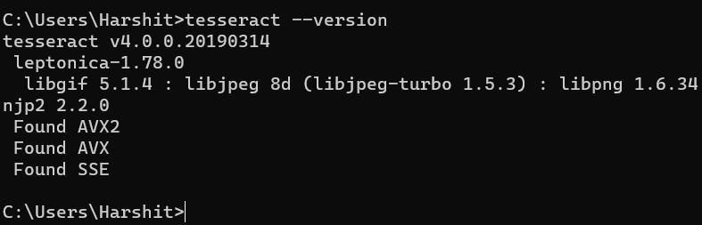

# OCR

# Libraries

#### installing PILLOW

`pip install pillow`

#### installing cv2

`pip install opencv-python`

#### installing tessaract

Before `pip install pytesseract`

install tessaract on your system from: [https://digi.bib.uni-mannheim.de/tesseract/](https://digi.bib.uni-mannheim.de/tesseract/)

For my device:

[https://digi.bib.uni-mannheim.de/tesseract/tesseract-ocr-w64-setup-v4.1.0.20190314.exe](https://digi.bib.uni-mannheim.de/tesseract/tesseract-ocr-w64-setup-v4.1.0.20190314.exe)

Once Installed set up the path under environmental variable.

In cmd check `tesseract —version`



Now install pytesseract `pip install pytesseract` in your venv.


Once all setup import libs

```jsx
import cv2
from PIL import Image
import pytesseract
```

# PILLOW

## Loading the image into memory

- we need to convert pdf into images
- image into ocr raw text output


```jsx
from PIL import Image
img_file="data/"

img=Image.open(img_file)
print(img)
```

Meta data: `<PIL.PngImagePlugin.PngImageFile image mode=RGBA size=649x712 at 0x2332B3FC640>`

to open and view the image `img.show()`

to `.rotate` 

to `.save`

Then will pass it to tesseract

# How to process Image for OCR

## To cover:

- Inverted Image
- Rescaling
- Binarization
- Noise Removal
- Rotation/ DE-skewing
- Removing Borders
- Missing Borders
- Transparency / Alpha Channel
